## Minikube status

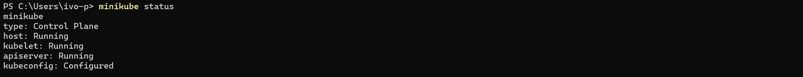

## Configmap

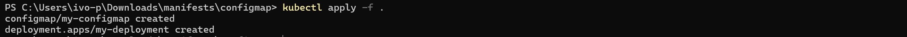
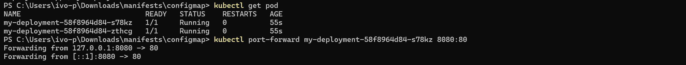
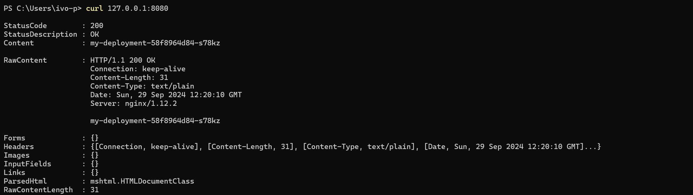

## Cronjob

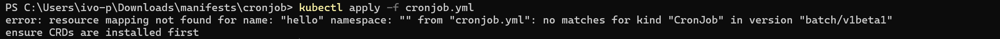
=> Меняем `apiVersion: batch/v1beta1` на `apiVersion: batch/v1`
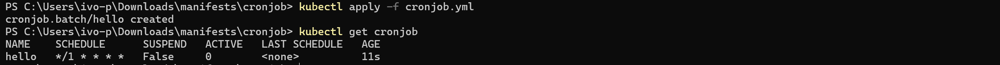
Ждем минуту
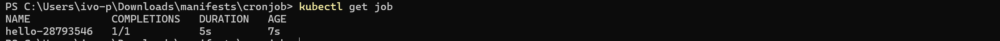
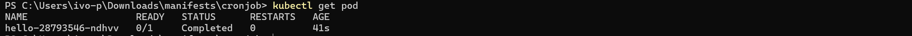
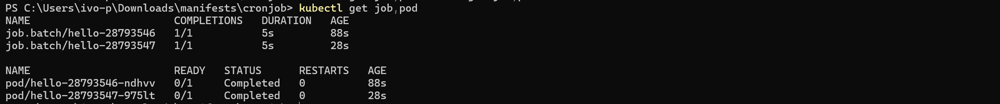
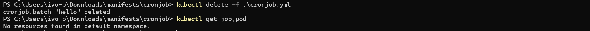

## Daemonset

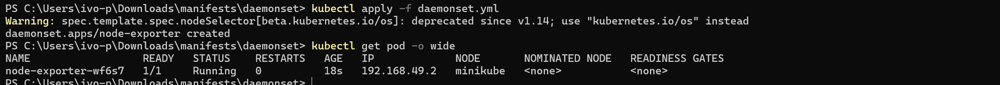

## Deployment

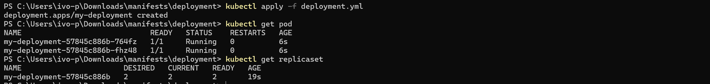
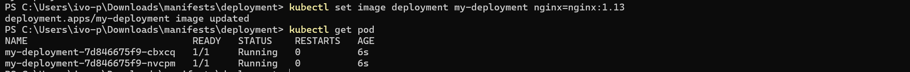
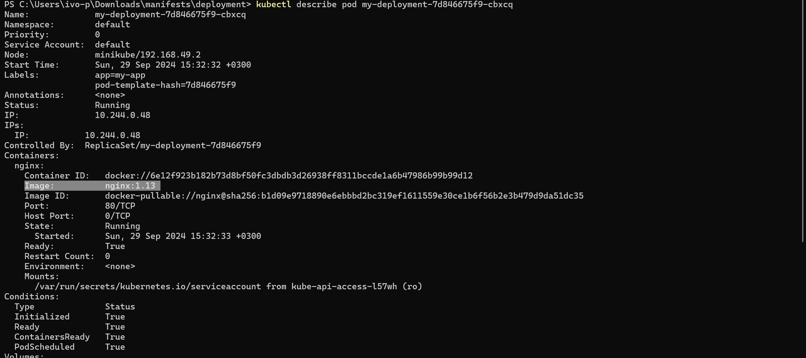
Версия контейнера выделена
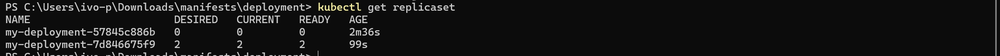

## Job

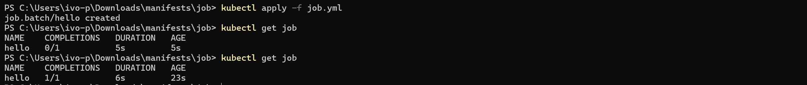

### backoffLimit

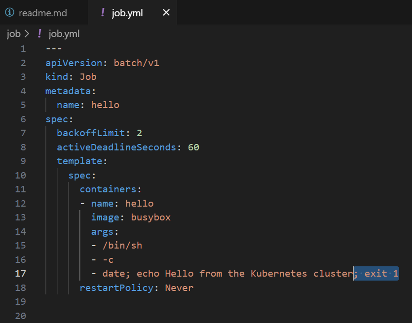
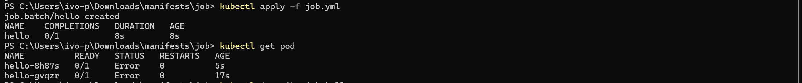
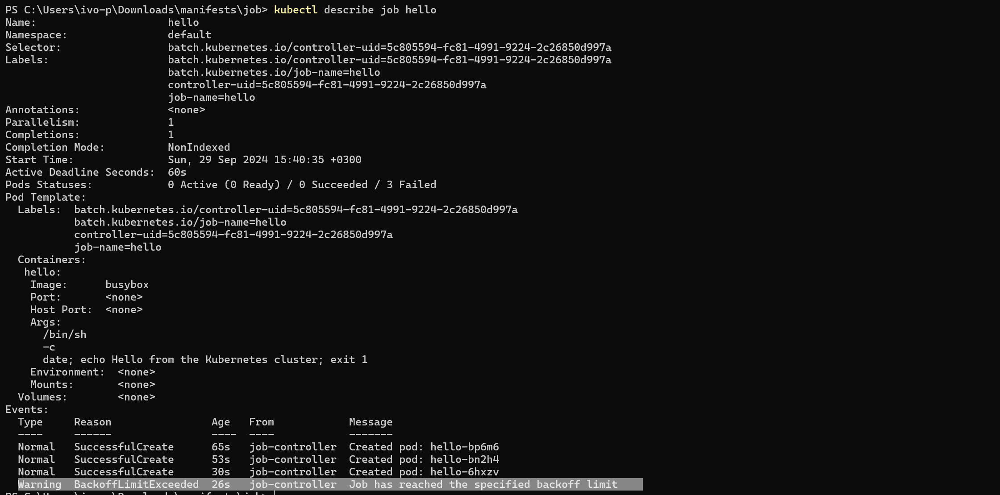

### activeDeadlineSeconds

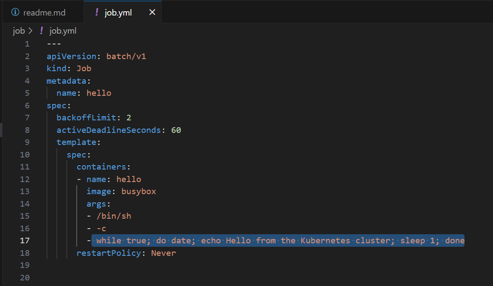
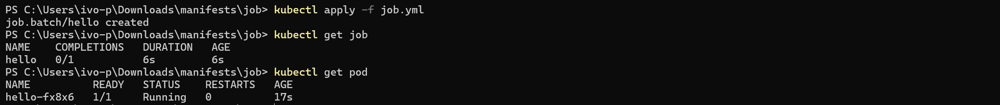
Ждем 100 секунд
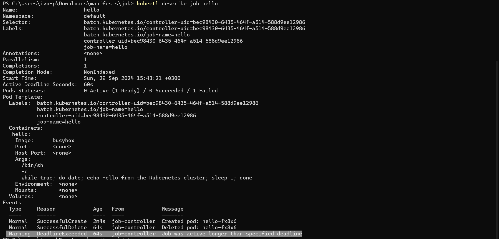

## Pod

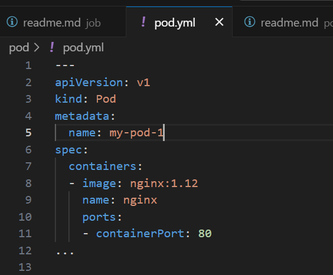

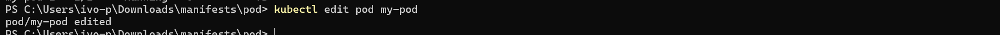
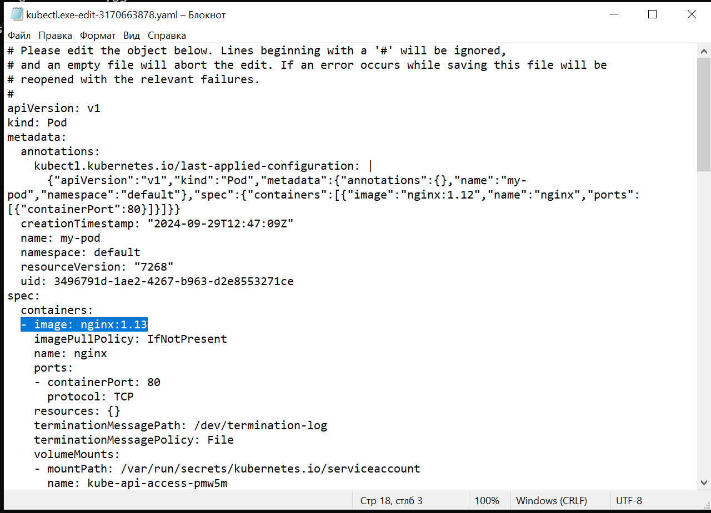
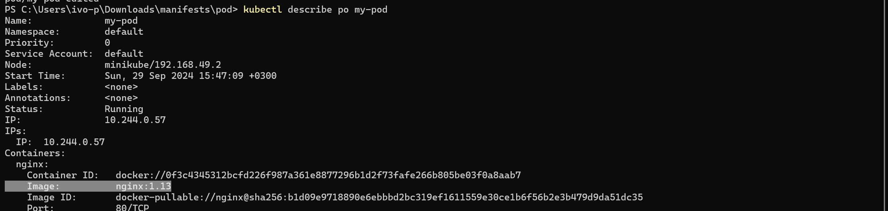
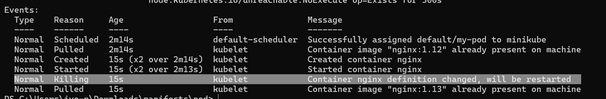

## ReplicaSet

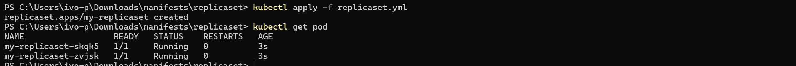

### Скейлим

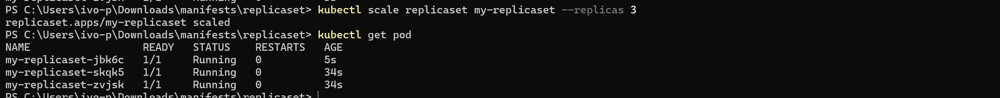

### Удаляем один из Pod

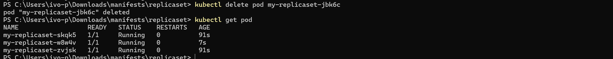

### Добавляем лишний Pod

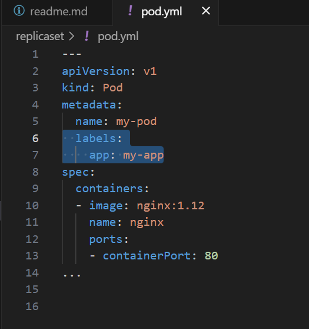
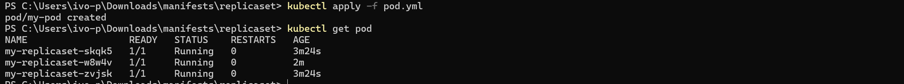

### Обновляем версию Image для container

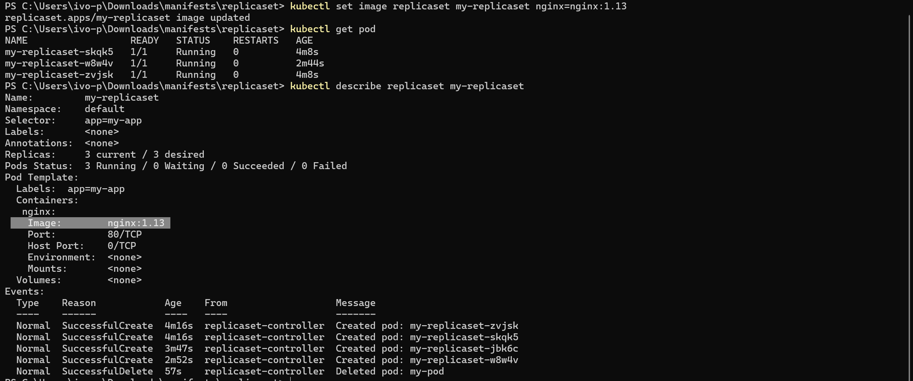
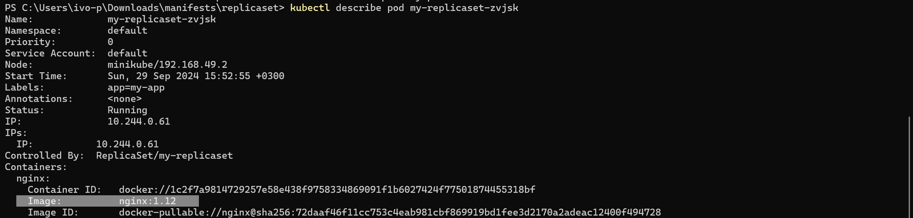
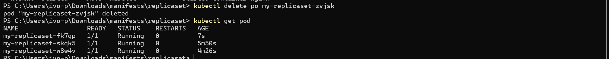
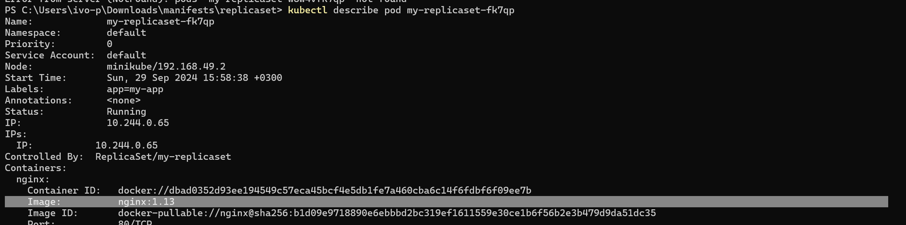

## Secret

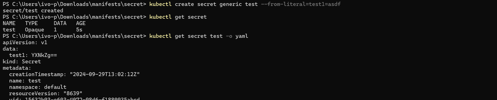
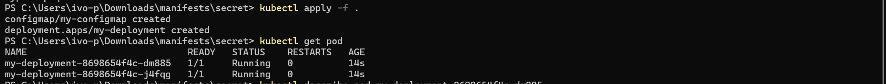
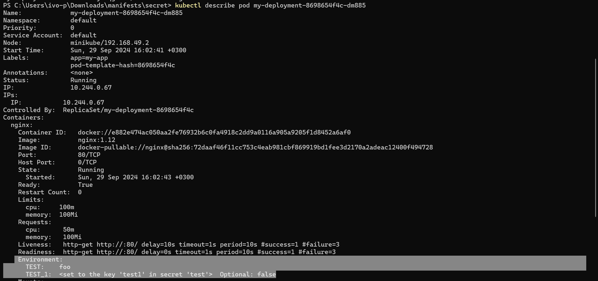

## Service

Возвращаемся на шаг Secret и повторяем все шаги (но ничего не удаляем в конце :)

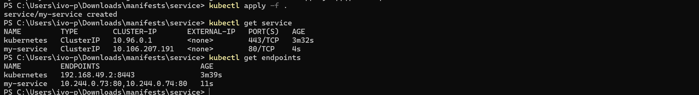
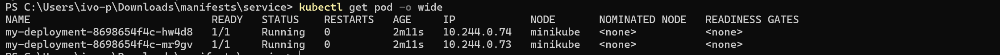
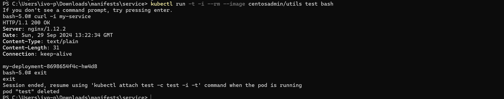
